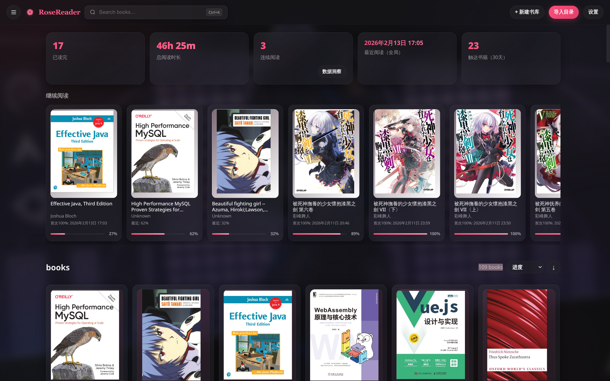
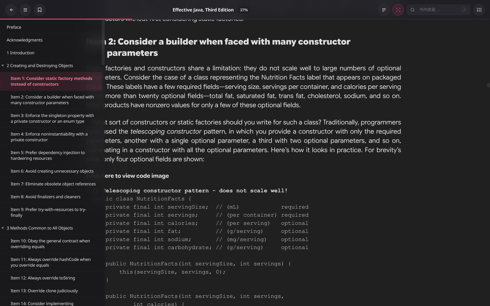
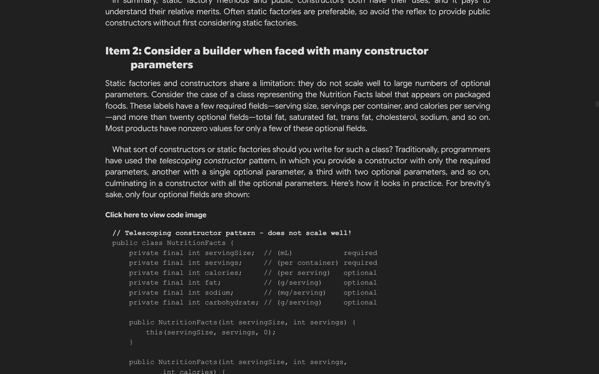
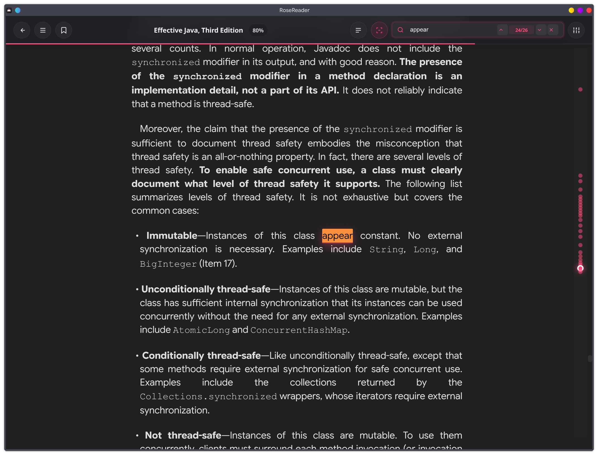
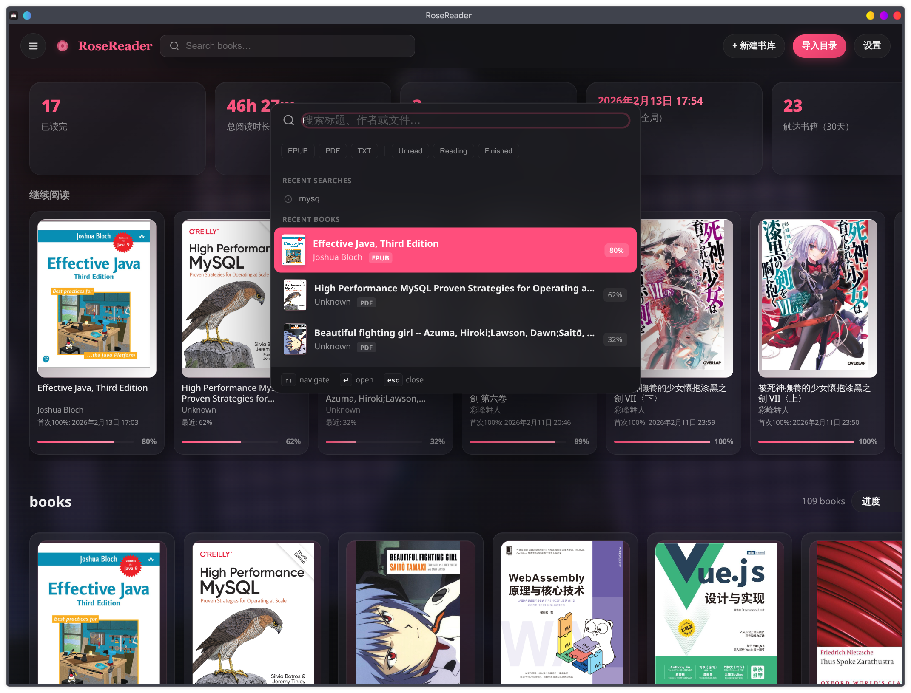
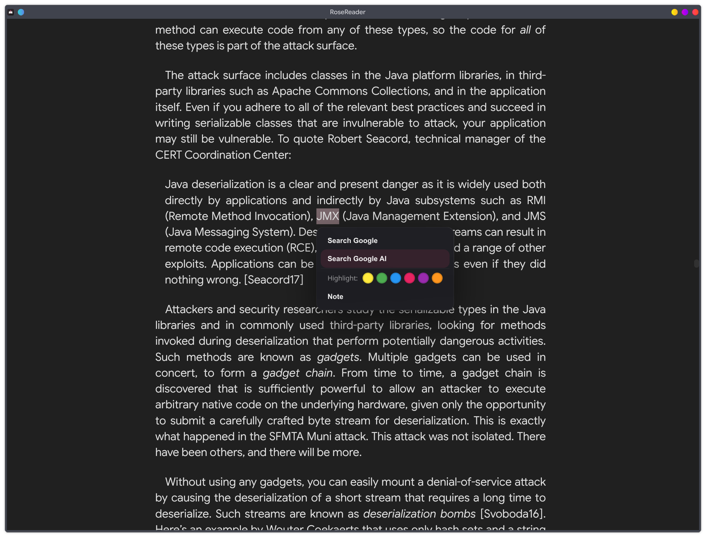
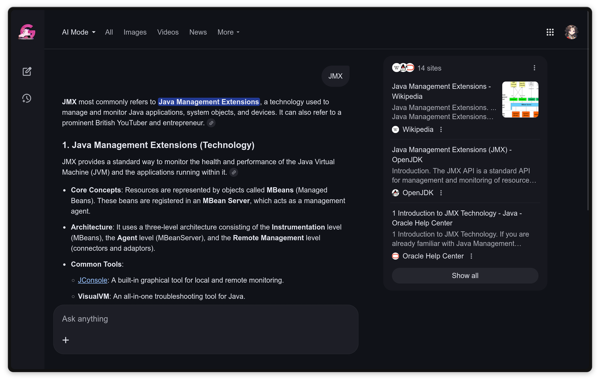

# RoseReader

[English](README.md) | [简体中文](README.zh-CN.md)

RoseReader is a vibe-coding project: a simple cross-platform EPUB/PDF/TXT reader focused on an infinite-scrolling reading experience.

## Overview

RoseReader is built for people who want a lightweight local reader with better flow than traditional paged EPUB apps, especially on Linux.

It focuses on:
- fast local library import from folders
- smooth infinite-scroll EPUB reading
- practical reading tools (search, bookmarks, highlights, notes)
- persistent reading state (progress, history, analytics)

## Key Features

### Library & Organization

- Import directories as libraries.
- Folder tree navigation and management.
- Move books between folders (optionally move files on disk).
- Auto-watch filesystem changes and detect new/changed books.

### Reader Experience

- Infinite-scroll EPUB rendering.
- PDF and TXT support.
- In-book search and TOC navigation.
- Customizable fonts, spacing, and reading themes.
- Selection popup actions (including quick Google / Google AI Mode lookup).

### Reading State Durability

- Progress, last-read time, and completion tracking.
- Bookmarks, highlights, and notes.
- Fingerprint-based moved-book recovery.
- Manual merge action in Settings for moved/duplicate book state.

## Screenshots

### Main Reading UI





### Nested Highlights & Locator


### Search Codemap Style Hints



### Library Search



### Selection to Google AI Mode




## Tech Stack

- Electron
- Node.js
- `epub2`
- `pdf-parse`
- `pdfjs-dist`

## Installation

### Windows

Currently, the most reliable way on Windows is running from source:

1. Install Node.js 20+.
2. Clone this repository.
3. Install dependencies:

```bash
npm install
```

4. Start the app:

```bash
npm start
```

Optional local packaging test (unpacked directory):

```bash
npm run pack
```

### Linux

#### Option A: Run from source

```bash
npm install
npm start
```

#### Option B: Arch Linux package (`PKGBUILD`)

```bash
makepkg -si
```

The launcher exports:

```text
ROSE_DATA_DIR=${XDG_CONFIG_HOME:-$HOME/.config}/RoseReader
```

On Linux, `npm run start` and the packaged app share this same persistence directory, so reading progress and annotations are not split.

## Development

Requirements:
- Node.js 20+

Install dependencies:

```bash
npm install
```

Run in development:

```bash
npm start
```

Create unpacked build:

```bash
npm run pack
```

Build distributables:

```bash
npm run build
```

## Data Storage

Data is persisted under the app data directory as:
- `rosereader-data.json`
- `rosereader-data-backup.json`
- `covers/` (generated cover cache)

Stored content includes:
- libraries and books
- reading progress/history
- bookmarks/highlights/notes
- settings and analytics

## Project Structure

- `main.js`: Electron main process, scanning/import, persistence, IPC, migration.
- `index.html`: renderer UI, styling, and app behavior.
- `PKGBUILD`: Arch packaging helper.

## License

MIT
