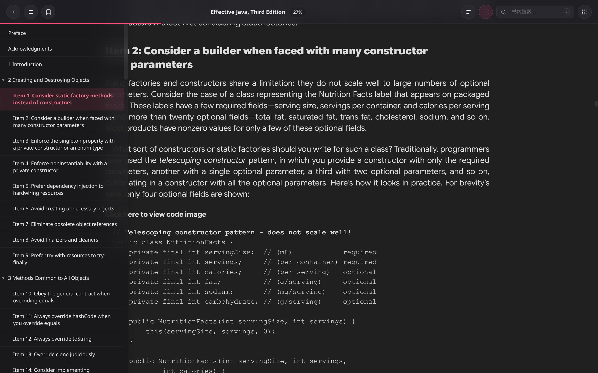
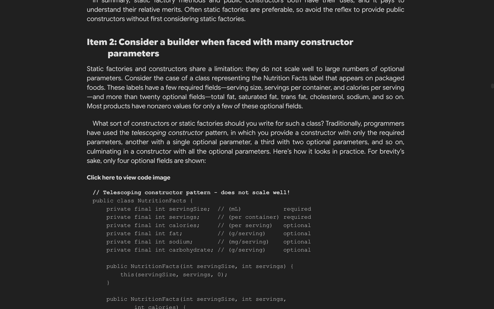
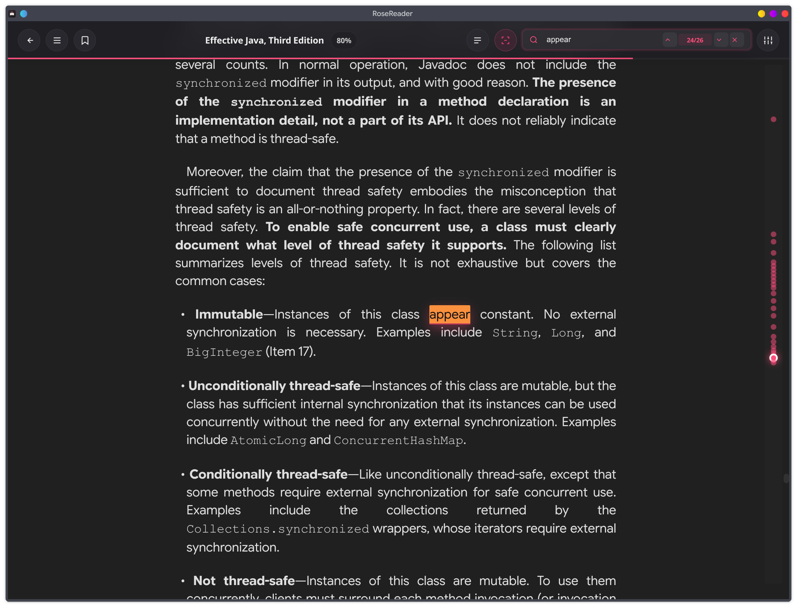
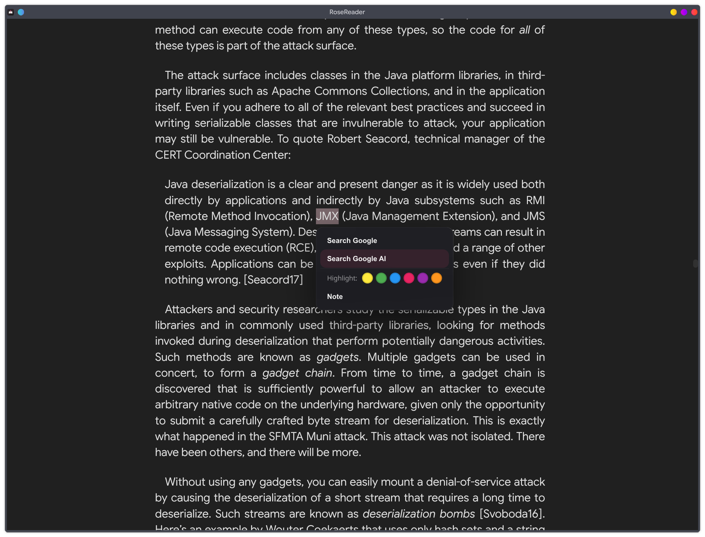

# RoseReader

[English](README.md) | [简体中文](README.zh-CN.md)

RoseReader 是一个本地优先的 Electron 阅读器，支持 EPUB、PDF、TXT 和 Markdown。它围绕顺滑的无限滚动阅读、可靠的阅读状态持久化，以及能贴合真实磁盘目录的书库模型构建。

## 项目简介

RoseReader 面向习惯把书保存在本地、并希望阅读器轻量实用的用户。它不做商店、同步服务或沉重的目录系统，而是专注把本地阅读体验做好。

核心目标：
- 支持由磁盘文件夹驱动的本地书库，并提供可选的逻辑收藏
- 为 EPUB、TXT、Markdown 提供无限滚动阅读
- 为 PDF 提供文本搜索和页面级高亮
- 持久化书内搜索索引，加速重复搜索
- 可靠保存进度、书签、高亮、笔记，并恢复移动后的书籍状态

## 主要功能

### 书库与组织

- 将本地目录导入为物理书库。
- 创建逻辑书库，用于不移动源文件的自定义收藏。
- 浏览文件夹树、创建文件夹，并在文件夹之间移动书籍。
- 整理物理书库时，可选择同步移动磁盘上的真实文件。
- 自动监听书库文件夹，刷新新增或变更的书籍。
- 支持书库排序和快捷搜索。
- 书籍移动后可恢复阅读状态，并可在设置中手动合并移动/重复记录。

### 阅读体验

- 支持 EPUB、PDF、TXT、Markdown，以及常见 Markdown 扩展名变体。
- EPUB 无限滚动渲染，并保存更精确的恢复位置快照。
- Markdown 支持渲染视图，也支持 raw / 区域 raw 阅读控制。
- PDF 支持 canvas 渲染、文本层搜索、高亮、缩放和重着色。
- 支持目录（TOC）导航，并在需要时提供回退/生成目录。
- 对没有内置目录的 TXT，按正文中的章节标题模式生成可用目录。
- 支持书签、高亮、嵌套高亮、PDF 页面高亮和笔记。
- 书内搜索提供类 codemap 的结果标记，并对 PDF 搜索高亮做懒渲染。
- 划词弹出操作支持快速 Google 和 Google AI Mode 查询。

### 自定义与 i18n

- 阅读设置支持字体、字号、间距、页边距、PDF 缩放、目录宽度、目录自动隐藏延迟。
- 阅读主题预设包括 Archive、Warm、Cream、Sepia、Paper、Night。
- 默认阅读主题为 Archive Paper：暖纸背景、深咖啡正文、灰棕次级文字、橙金强调和搜索高亮。
- 支持界面语言设置，并可跟随系统语言。

### 持久化与性能

- 阅读进度、最近阅读时间、完成状态、阅读统计和阅读历史均保存在本地。
- 书签、高亮、笔记、生成的 TXT 目录、书内搜索索引会随书籍记录保存。
- 持久化搜索索引会在文件签名仍匹配时复用，避免对稳定书籍反复做全文提取。
- 生成的 TXT 目录按文件签名缓存，源文件变化后会重新生成。
- 书库扫描会把不可用文件标记为 missing，而不是立刻丢弃阅读状态。
- 支持本地数据导出/导入。

## 截图

### 主阅读界面





### 嵌套高亮与定位提示


### 类 CodeMap 的搜索提示



### 书库搜索


### 划词跳转 Google AI Mode




## 技术栈

- Electron
- Node.js
- `epub2`
- `pdf-parse`
- `pdfjs-dist`

## 安装方式

### Windows

目前 Windows 上最稳定的方式是从源码运行：

1. 安装 Node.js 20+
2. 克隆本仓库
3. 安装依赖

```bash
npm install
```

4. 启动应用

```bash
npm start
```

### Linux

#### 方案 A：源码运行

```bash
npm install
npm start
```

#### 方案 B：Arch Linux（PKGBUILD）

```bash
makepkg -si
```

根目录的 `PKGBUILD` 会构建使用系统 Electron 运行时的 pacman 包，不再通过 `electron-builder` 生成 release 产物。

安装布局：
- 应用文件：`/usr/lib/rosereader`
- 启动器：`/usr/bin/rosereader`
- 桌面入口：`/usr/share/applications/rosereader.desktop`
- 图标：`/usr/share/icons/hicolor/scalable/apps/rosereader.svg`

启动器会导出：

```text
ROSE_DATA_DIR=${XDG_CONFIG_HOME:-$HOME/.config}/RoseReader
```

在 Linux 上，`npm start` 与打包安装版共享同一个持久化目录，因此进度、书签、高亮、笔记不会分裂。

## 开发

要求：
- Node.js 20+

安装依赖：

```bash
npm install
```

开发运行：

```bash
npm start
```

构建并安装 Arch Linux 包：

```bash
makepkg -si
```

## 数据存储

应用数据会持久化在数据目录中：
- `rosereader-data.json`
- `rosereader-data-backup.json`
- `covers/`（封面缓存）

包含内容：
- 书库、逻辑书库映射与书籍
- 阅读进度/历史和统计数据
- 书签/高亮/笔记
- 设置项，包括阅读主题和界面语言
- 生成的 TXT 目录缓存（仅保存标题和行号边界，正文仍保留在原文件中）
- 持久化书内搜索索引缓存（按章节/页保存纯文本）

搜索索引和生成的 TXT 目录会绑定文件签名，因此可复用稳定阅读文件的缓存，并在源文件变化后刷新。

## 项目结构

- `main.js`：Electron 主进程，负责扫描/导入、持久化、IPC、迁移、解析与打包运行逻辑
- `index.html`：渲染层 UI、阅读样式、国际化字符串与应用交互逻辑
- `search-index.js`：书内搜索索引构建、校验和搜索辅助逻辑
- `PKGBUILD`：使用系统 Electron 的 Arch Linux 打包入口
- `rosereader.desktop`：Linux 桌面启动器元数据
- `icon.svg`：应用图标，也是软件包使用的图标

## License

MIT
